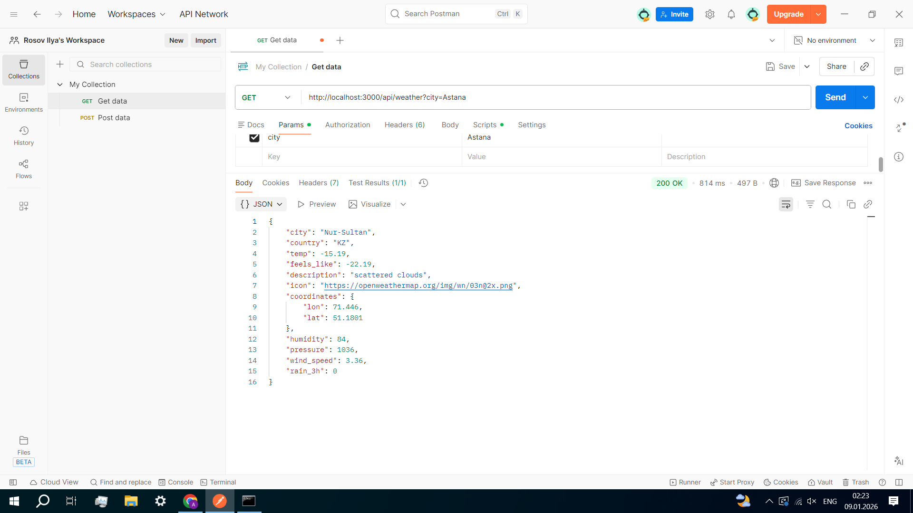
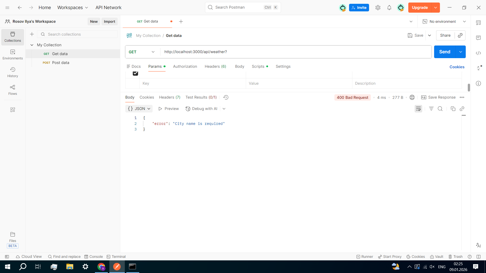
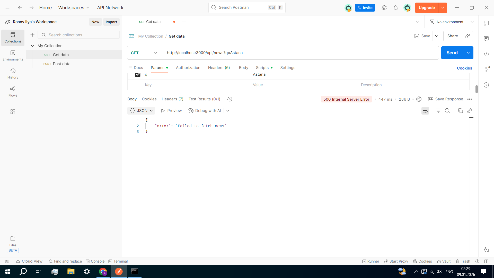
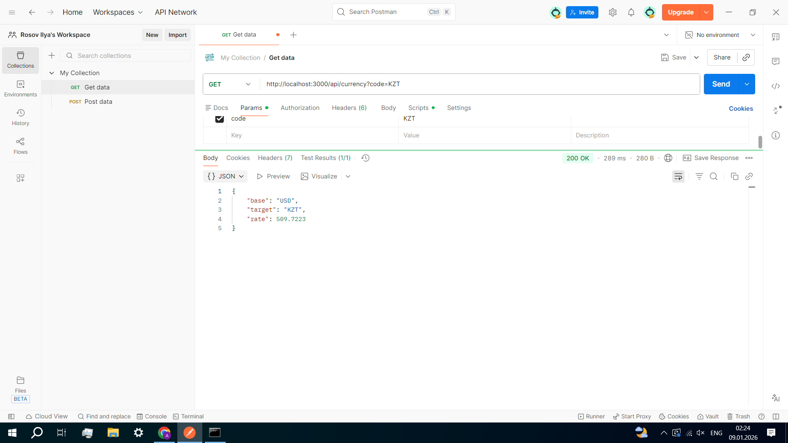
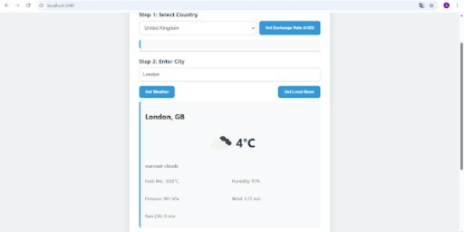

## Project Description
This application is a comprehensive dashboard developed for Assignment 2. It integrates three different APIs to provide real-time weather, global news, and currency exchange rates.
##  Setup & Installation
1. **Install Dependencies:** `npm install`
2. **Environment Setup:** Create a `.env` file with your API keys.
3. **Start Server:** `node server.js`
4. **Open Browser:** `http://localhost:3000`
## Backend API Testing (Postman Evidence)

### 1. Weather API Testing
| Case | Status Code | Evidence |
| :--- | :--- | :--- |
| **Success** | 200 OK |  |
| **Bad Request** | 400 |  |
| **Not Found** | 404 |  |
| **Server Error**| 500 |  |

### 2. News API Testing
| Case | Status Code | Evidence |
| :--- | :--- | :--- |
| **Success** | 200 OK |  |
| **Bad Request** | 400 |  |
| **Not Found** | 404 |  |
| **Server Error**| 500 |  |

### 3. Currency API Testing
| Case | Status Code | Evidence |
| :--- | :--- | :--- |
| **Success** | 200 OK |  |
| **Bad Request** | 400 |  |
| **Not Found** | 404 |  |
| **Server Error**| 500 |  |
## User Interface (Browser Screenshots)

### 1. Country Selection & Currency

### 2. Weather Dashboard & Map

### 3. Local News Results

---

### Design Decisions
- **Security:** Used `.env` to hide API keys from the client side.
- **Robustness:** Implemented `try...catch` blocks for all status codes (400, 404, 500).
- **Mapping:** Integrated `Leaflet.js` to show city location via coordinates.

### Code for testing:
http://localhost:3000/api/weather?city=Astana
http://localhost:3000/api/news?q=Astana
http://localhost:3000/api/currency?code=KZT